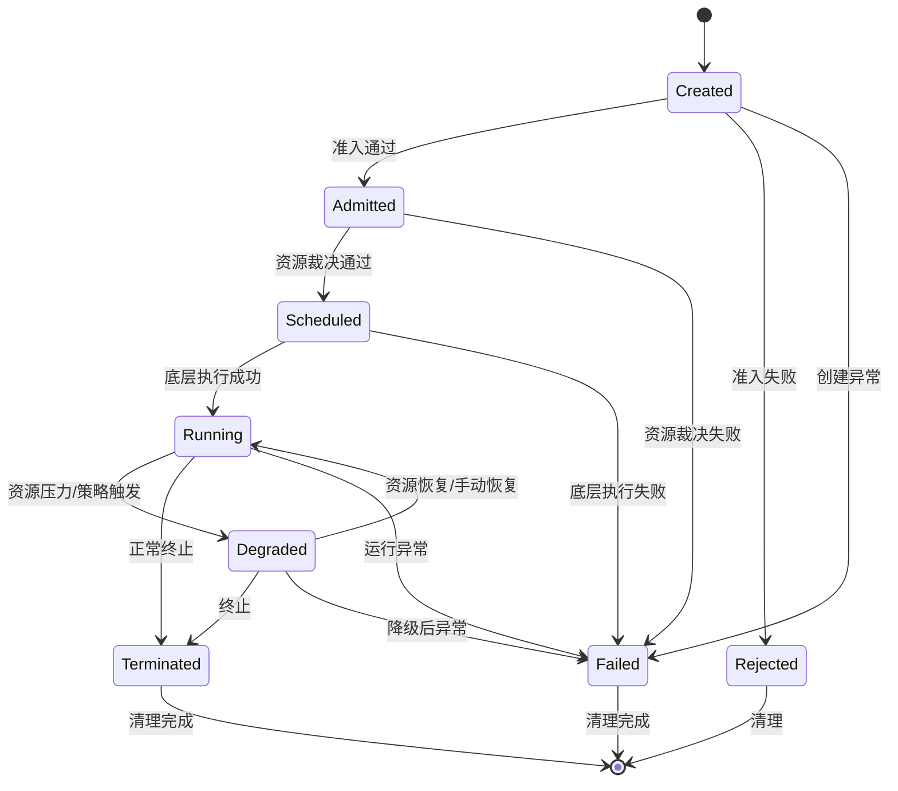

# 分布式应用运行时操作系统（Distributed Application Runtime OS）设计文档

本文档描述一个面向**应用（Application）**的、分布式的运行时操作系统——**D-AROS（Distributed Application Runtime Operating System）**的设计目标、责任边界、核心抽象与总体架构，用于指导工程实现、系统评审与长期演进。

---

## 1. 背景与问题定义

### 1.1 背景

随着应用形态从单体程序演进为**跨节点、跨资源池的分布式系统**，传统单机操作系统在进程管理、调度与资源隔离层面提供的能力，已无法覆盖"**应用整体运行态**"的管理需求。

在云原生体系中，Kubernetes在工程实践上成功解决了以下关键问题：

- 容器化执行环境的标准化
- 基础资源抽象（CPU / Memory / Device）
- Pod级别的调度、自愈与扩缩容

然而，Kubernetes的设计目标是一个**通用的集群操作系统（Cluster OS）**，而非面向"应用语义"的运行时系统。

---

### 1.2 现有方案的结构性不足

在大规模分布式系统实践中，现有方案逐渐暴露出以下结构性不足：

- **缺乏应用级抽象**
  Kubernetes以Pod / Workload为中心，无法原生表达"一个应用由多个组件组成，并具有整体运行目标"的概念。

- **调度缺乏业务裁决能力**
  调度决策以资源可行性为核心，难以统一处理SLA、优先级、成本等业务级约束。

- **PaaS平台能力退化**
  多数PaaS平台仅对Kubernetes API进行CRUD封装，而未真正承担运行时控制平面的职责。

---

### 1.3 问题定义

是否可以在现有分布式内核之上，引入一个**以应用(Application)为一等公民**的运行时操作系统抽象，用于统一描述、裁决与控制分布式应用的运行状态？

**D-AROS**即为对此问题的系统化回答。

---

## 2. 系统定位与责任边界（核心约束）

### 2.1 系统定位

D-AROS的系统定位是：

> **位于集群操作系统之上的分布式应用运行时操作系统（Application Runtime OS）**

它不直接管理物理资源，也不承载业务逻辑，而是负责：

- 描述应用"**应该如何运行**"
- 在多应用之间进行**运行时裁决（Arbitration）**
- 将裁决结果下发给底层集群内核执行

---

### 2.2 分层视图

```text
┌────────────────────────────────┐
│  Application / Platform Layer  │  ← 业务系统 / CI/CD / 控制台
├────────────────────────────────┤
│        D-AROS Runtime OS       │  ← 应用模型 / 生命周期 / 裁决
├────────────────────────────────┤
│   Cluster OS (K8s / Nomad)     │  ← Pod / Task 调度与执行
├────────────────────────────────┤
│      Infrastructure Layer      │  ← 物理机 / 网络 / 存储
└────────────────────────────────┘
```

---

### 2.3 责任边界定义

**D-AROS的职责（必须承担）：**

- 应用运行时抽象建模
- 应用生命周期状态机管理
- 应用级资源裁决与优先级控制
- 调度策略与机制解耦

**D-AROS明确不承担的职责（Non-Goals）：**

1. **不管理物理节点生命周期**
2. **不实现容器/Pod级调度**（复用底层Cluster OS能力）
3. **不替代Kubernetes/Nomad的核心能力**
4. **不提供完整的PaaS用户界面**
5. **不内置复杂的CI/CD流水线**
6. **不处理应用级别的数据持久化与备份**
7. **不直接提供跨云网络连接**

> 任何越过该边界的设计，都会导致系统复杂度失控。

---

### 2.4 为什么 Kubernetes Scheduler 不适合作为应用调度器

这一节用于**明确Kubernetes的调度器边界**，解释为什么它不能直接承担"分布式应用运行时操作系统"中 **应用级调度器（Application Scheduler）** 的职责，从而为"为什么需要在K8s之上构建一层应用运行时系统"提供技术上的正当性。

#### 2.4.1 Kubernetes Scheduler的设计目标

Kubernetes Scheduler的核心职责是：

> **为Pod选择一个合适的Node**

其调度决策围绕以下问题展开：

- 这个Pod能不能放到某个Node上？（Predicate / Filter）
- 放到哪个Node上"更合适"？（Priority / Score）

它关注的核心维度包括：

- CPU / Memory / Ephemeral Storage等**节点级资源**
- Node Label / Taint / Toleration
- Pod Affinity / Anti-Affinity
- Topology Spread Constraints

> 👉 **本质上，Kubernetes Scheduler是一个「节点资源调度器」**，而不是应用调度器。

#### 2.4.2 应用调度器需要解决的问题（K8s Scheduler不关心）

在"分布式应用运行时操作系统"的语境下，一个**应用调度器**通常需要解决：

- 应用由哪些组件组成？（Service / Worker / Actor / Task DAG）
- 组件之间的**启动顺序、依赖关系、生命周期编排**
- 应用级QoS（SLA、延迟、吞吐、可用性）
- 应用级弹性策略（Scale Out / Scale In / 灰度 / 回滚）
- 应用整体的资源预算与成本约束
- 应用状态与运行时上下文（Session / Workflow / State）

这些问题具有明显特征：

- 跨Pod
- 跨Node
- 跨时间（生命周期、阶段性状态）

> 👉 **Kubernetes Scheduler** **不具备"应用整体视角"**。

#### 2.4.3 调度粒度不匹配：Pod ≠ Application

Kubernetes Scheduler的调度对象是：

- 单个Pod

而在目标系统中，调度对象是：

- 一个完整的"应用实例"
- 或一个应用的运行阶段（Phase / Stage）

例如：

- 一个流式计算应用需要先启动Coordinator，再启动Workers
- 一个AI任务需要GPU Worker与Parameter Server协同调度
- 一个在线应用需要保证Web + Cache + DB Proxy的拓扑一致性

这些都无法用"一个Pod放到哪个Node"来表达。

> 👉 **Pod** **调度是必要条件，但不是充分条件**。

#### 2.4.4 无法表达应用级调度约束

Kubernetes Scheduler的约束模型主要是：

- Node维度约束
- Pod之间的简单亲和/反亲和关系

但应用调度器常见的约束包括：

- "这个应用最多只能占用整个集群20%的资源"
- "该应用的副本必须分布在至少3个机架"
- "当下游组件未Ready时，不允许上游扩容"
- "同一租户的应用之间需要公平调度"

这些约束：

- 无法自然映射到Pod-Level Scheduling
- 即使勉强实现，也会导致Scheduler插件极度复杂

#### 2.4.5 扩展Kubernetes Scheduler的代价

理论上，可以通过：

- Scheduler Framework
- 自定义Filter / Score插件

来"增强"Kubernetes Scheduler。

但在工程实践中会遇到：

- 插件逻辑必须在**同步调度路径**中执行，复杂度受限
- 调度器状态主要是Node / Pod视角，维护应用状态极其困难
- 与K8s内部调度策略强耦合，升级成本高
- 需要深入理解Scheduler内部实现细节

> 👉 **这会把一个应用调度问题，强行塞进一个节点调度器中**。

#### 2.4.6 工业界的通用做法

工业界通常采用**分层调度（Two-Level Scheduling）**：

- **Kubernetes Scheduler**：
  - 负责Pod → Node的映射
  - 提供稳定、通用的资源分配能力
- **上层应用调度器/运行时系统**：
  - 决定"是否创建Pod"
  - 决定"创建多少Pod"
  - 决定"应用处于哪个运行阶段"

典型案例：

- Spark on Kubernetes
- Ray
- Flink
- Argo Workflows
- Volcano（批处理/AI调度）

#### 2.4.7 本系统的定位结论

因此，在本设计中：

- Kubernetes被视为：

**分布式资源内核（Distributed Resource Kernel）**

- 本系统承担：

**应用运行时操作系统（Application Runtime OS）**

两者关系为：

本系统通过Kubernetes提供的资源抽象运行，但不试图替代Kubernetes Scheduler，而是在其之上实现应用级调度与运行时管理。

这也是本系统存在的根本技术理由之一。

---

## 3. 设计目标与原则

### 3.1 核心目标

为分布式应用提供类似单机操作系统的能力：

- 可描述的运行态（Describable State）
- 可裁决的资源使用（Arbitrable Resource Usage）
- 可预测的生命周期演进（Predictable Lifecycle）

---

### 3.2 设计原则

- **Application-first**：应用是一等公民
- **声明式驱动**：描述期望状态，而非命令式操作
- **策略与机制解耦**：机制稳定，策略可演进
- **不重复造轮子**：复用成熟的Cluster OS

---

### 3.3 核心设计哲学：运行时中立（Runtime-Agnostic）

D-AROS采用**运行时中立**的设计哲学：

1. **控制平面与数据平面解耦**：控制平面不感知具体运行时实现细节
2. **抽象与实现分离**：应用和负载描述与具体执行技术解耦
3. **适配器模式**：通过Runtime Adapter桥接不同运行时环境
4. **失败模型统一**：不同运行时的失败被抽象为统一的系统事件

这一哲学使D-AROS能够支持：
- 容器（Linux/Windows）
- 虚拟机
- 物理进程
- 未来可能出现的新的运行时技术

---

## 4. 核心抽象与对象模型

本章定义D-AROS的核心对象模型。这些抽象共同构成一个**以应用为中心、与具体运行时解耦**的分布式应用运行时操作系统内核。

---

### 4.1 Application（应用，一等公民）

> **Application是D-AROS中的最高级抽象单位。**

Application表示一个具有**整体运行目标、生命周期和资源边界**的分布式应用实例。

Application责任描述：

- Application由哪些**Workload**组成
- Application整体的**运行目标（SLA / QoS）**
- Application的**资源预算与优先级**
- Application的**生命周期策略**

Application**不关心**：

- 具体运行在哪种操作系统
- 使用哪种运行时技术（容器/虚拟机/进程）

> 👉 Application是"运行时无关的逻辑实体"。

---

### 4.2 Workload（运行负载，运行时无关抽象）

> **Workload是D-AROS中"可被调度和执行的最小单位"。**

与Kubernetes Pod不同，Workload是一个**运行时中立（Runtime-Agnostic）**的抽象。

#### 4.2.1 Workload的核心职责

Workload用于描述：

- **需要被执行的计算单元**
- **所需的运行时环境能力**
- **资源需求**
- **生命周期控制边界**

但不直接绑定任何具体执行技术。

#### 4.2.2 Workload抽象结构

```text
Workload
├── RuntimeRequirement
│   ├── RuntimeType
│   └── OSRequirement
├── ResourceProfile
├── LifecyclePolicy
└── RuntimeSpec (Opaque)
```

#### 4.2.3 RuntimeRequirement

RuntimeRequirement用于显式描述Workload对运行环境的要求：

- **RuntimeType**
  - container
  - virtual-machine
  - process
- **OSRequirement**
  - linux
  - windows

示例（概念性）：

```yaml
runtime:
  type: container
  os: linux
```

> 👉 这是D-AROS支持多运行时的**最小、也是最关键的建模点**。

#### 4.2.4 RuntimeSpec

RuntimeSpec是对具体运行时的**不透明描述**：

- 对D-AROS Control Plane**不可解析**
- 仅由对应的Runtime Adapter理解

示例：

- Container RuntimeSpec：PodTemplate
- VM RuntimeSpec：VM Image / Disk / Cloud-Init
- Windows RuntimeSpec：Service Definition / Binary Path

> 👉 Control Plane永远不直接依赖RuntimeSpec结构。

---

### 4.3 Execution Node（执行节点）

> **Execution Node表示"可以承载Workload的执行实体"。**

Execution Node是对底层计算节点的统一抽象，可能对应：

- Kubernetes Node（Linux / Windows）
- 虚拟化宿主机
- 裸金属节点

#### 4.3.1 Execution Node能力模型

```text
ExecutionNode
├── ResourceCapacity
├── OS
├── SupportedRuntimes
└── RuntimeCapabilities
```

示例：

- Linux Node
  - container ✅
  - vm ✅
  - windows-container ❌
- Windows Node
  - windows-container ✅
  - vm ❓

---

### 4.4 Resource Pool（资源池）

> **Resource Pool是对底层资源的逻辑聚合视图。**

Resource Pool提供的是：

- **可裁决容量**
- 而非具体节点资源

它屏蔽了节点异构性，为调度与裁决提供统一输入。

#### 4.4.1 Resource Pool的管理与映射

- **管理主体**：由Platform Admin或自动化工具创建和管理
- **动态发现**：基于底层Cluster OS的节点标签、资源类型等条件动态构建
- **映射关系**：
  - 一个Resource Pool可包含多个底层Cluster OS的Namespace/ResourceQuota
  - 一个Execution Node可属于多个Resource Pool（基于标签选择器）
- **用途**：作为Tenant配额分配和Application调度的基本单位

---

### 4.5 Runtime（运行时）与Runtime Adapter

> **Runtime是Workload实际执行的技术载体，Runtime Adapter是关键桥梁。**

#### 4.5.1 Runtime的系统定位

Runtime位于：

```text
D-AROS Control Plane
        ↓
    Runtime Adapter
        ↓
   Cluster OS / Hypervisor
```

D-AROS**不直接操作**：

- Pod
- VM
- Windows Service

而是通过Runtime Adapter间接控制。

#### 4.5.2 Runtime Adapter（关键组件）

Runtime Adapter负责将D-AROS的通用控制指令，翻译为具体运行时的操作。

统一接口示意：

```text
RuntimeAdapter
├── CreateWorkload(workloadSpec) → workloadID
├── StartWorkload(workloadID)
├── StopWorkload(workloadID)
├── DestroyWorkload(workloadID)
├── InspectWorkload(workloadID) → workloadStatus
└── GetRuntimeCapabilities() → capabilities
```

典型实现：

- Kubernetes Container Runtime Adapter
- KubeVirt / VM Runtime Adapter
- Windows Container Runtime Adapter
- Process Runtime Adapter（未来）

> 👉 Runtime Adapter是平台可扩展性的唯一入口。

---

### 4.6 Application Instance（运行实例）

> **Application Instance表示Application在某一时刻的具体运行态。**

它关联：

- Application Spec
- 一组Workload Instance
- 当前Lifecycle Phase
- Runtime状态汇总

#### 4.6.1 关键属性

```text
ApplicationInstance
├── ApplicationID
├── TenantID
├── CurrentPhase
├── WorkloadInstances[]
│   ├── WorkloadID
│   ├── RuntimeID (由Adapter分配)
│   ├── Placement (ResourcePool/Node)
│   └── Status (Ready/Error/Stopped)
├── ResourceAllocation
├── LastArbitrationResult
└── HealthSummary
```

---

### 4.7 Failure Model（失败模型）

> **失败被建模为跨层、跨运行时的系统事件，而非单一Pod异常。**

#### 4.7.1 失败类型分类

```text
Failure
├── Infrastructure Failure (节点宕机、网络分区)
├── Runtime Failure
│   ├── ContainerCrash
│   ├── VMExit
│   ├── WindowsServiceStopped
│   └── AdapterCommunicationError
├── Application Failure (业务逻辑错误、健康检查失败)
├── Control Plane Failure (D-AROS组件异常)
└── Policy Violation (违反调度或安全策略)
```

#### 4.7.2 失败处理流程示例

```text
1. 容器崩溃 (Runtime Failure)
2. Runtime Adapter 感知并上报事件
3. D-AROS 事件总线接收事件
4. 根据 Application 的 LifecyclePolicy 决定动作
   - 重启 (默认)
   - 等待人工介入
   - 标记为失败并停止关联组件
5. 通过 Runtime Adapter 执行决策
```

#### 4.7.3 失败的处理原则

- D-AROS感知**失败语义**
- Runtime Adapter处理**失败细节**
- Application Lifecycle决定**应对策略**
- 所有失败处理必须通过状态机驱动

---

### 4.8 抽象设计总结

通过以上模型，D-AROS明确实现了：

- **应用与运行时解耦**
- **调度与执行解耦**
- **策略与机制解耦**

从而支持：

- Linux / Windows混合集群
- Container / VM / 未来运行时
- 应用级调度与裁决

---

## 5. 调度与资源裁决模型

### 5.1 调度问题抽象

调度在D-AROS中被抽象为：

> 在多应用、多约束条件下的**资源裁决问题（Arbitration）**

主要约束包括：

- 资源容量限制
- 应用优先级
- SLA / 延迟目标
- 系统整体利用率

#### 5.1.1 术语澄清

- **裁决（Arbitration）**：D-AROS层面的、应用级的、考虑多维约束的决策过程
- **调度（Scheduling）**：特指底层Cluster OS（如K8s）将Pod分配到Node的过程

---

### 5.2 多级裁决模型

1. **准入裁决（Admission Control）**
   - 校验Application Spec合法性
   - 检查Tenant配额
   - 应用全局策略过滤器

2. **资源裁决（Resource Arbitration）**
   - 在多应用间分配Resource Pool容量
   - 考虑优先级、SLA、亲和性等约束
   - 输出应用级资源分配方案

3. **放置提示生成（Placement Hint Generation）**
   - 将应用级分配分解为Workload级放置建议
   - 考虑运行时兼容性、拓扑约束
   - 输出给Runtime Adapter执行

4. **运行时调整（Runtime Adjustment）**
   - 监控实际运行状态
   - 触发抢占、降级、重新裁决

---

### 5.3 裁决策略插件化

裁决引擎支持可插拔的策略：

- **Bin-Pack策略**：资源利用率优先
- **Spread策略**：可用性优先（跨故障域分布）
- **SLA-Aware策略**：低延迟应用优先
- **Cost-Aware策略**：成本约束优化
- **Fair-Share策略**：租户间公平分配

> D-AROS仅输出裁决结果，不负责具体节点选择。

---

## 6. 应用生命周期管理

本章描述D-AROS如何以**应用为一等公民**，对分布式应用的运行状态进行建模、控制与演进，并明确生命周期系统在整体架构中的地位与约束。

---

### 6.1 生命周期系统的设计目标

D-AROS的生命周期管理并非简单的"状态标记"，而是承担以下核心职责：

- 提供**全局一致的应用运行状态视图**
- 作为**运行时控制与裁决的唯一入口**
- 约束系统行为，防止控制逻辑失序
- 支撑应用级调度、扩缩容、降级、终止等操作

> 生命周期系统在D-AROS中的角色，等价于：
>
> **单机操作系统中的「进程状态机 + 系统调用边界」**

---

### 6.2 生命周期对象与状态域划分

#### 6.2.1 生命周期对象

生命周期管理的**最小控制对象**是：

> **Application Instance（应用实例）**

而非：

- 单个Pod
- 单个Component
- 单个任务或容器

所有生命周期状态，均以**Application Instance**为粒度。

#### 6.2.2 状态域划分原则

生命周期状态被划分为两类：

- **期望态（Desired State）**
- **现实态（Observed State）**

```text
Application Spec        ← 期望态（用户声明）
Application Status      ← 现实态（系统裁决与执行结果）
```

D-AROS的生命周期系统负责：

- 比较期望态与现实态
- 通过状态迁移，推动系统向期望态收敛

---

### 6.3 生命周期状态定义

#### 6.3.1 核心生命周期状态

D-AROS定义如下应用生命周期状态：

| 状态           | 含义                               | 可接受操作                        |
| -------------- | ---------------------------------- | --------------------------------- |
| **Created**    | 应用对象已创建，但尚未参与任何裁决 | UpdateSpec, Delete                |
| **Admitted**   | 通过准入裁决，获得运行资格         | UpdateSpec, Delete, Start         |
| **Scheduled**  | 完成应用级调度决策，等待底层执行   | UpdateSpec, Delete, Stop          |
| **Running**    | 应用组件已启动并处于正常运行       | UpdateSpec, Delete, Stop, Scale   |
| **Degraded**   | 资源不足或策略触发下的降级运行     | UpdateSpec, Delete, Stop, Restore |
| **Terminated** | 应用已被显式或隐式终止             | Delete (清理资源)                 |
| **Failed**     | 应用运行失败且无法自动恢复         | Delete, Retry                     |

#### 6.3.2 状态的语义约束

- **状态是"裁决结果"，不是操作命令**
- 状态只能由生命周期系统修改
- 外部系统不得绕过状态机直接操纵运行实体

> 👉 **状态不是标签，而是系统的"法律状态"**

---

### 6.4 生命周期状态机模型

#### 6.4.1 状态迁移总览




#### 6.4.2 关键状态迁移说明

**Created → Admitted**
- 触发条件：
  - 应用描述合法
  - 租户配额未超限
  - 全局策略允许准入
- 触发模块：
  - Admission Controller
  - Resource & Quota Manager

**Admitted → Scheduled**
- 触发条件：
  - 调度与裁决引擎完成应用级资源裁决
- 迁移结果：
  - 生成组件级运行计划
  - 输出Placement Hint / Resource Allocation

**Scheduled → Running**
- 触发条件：
  - 底层Cluster OS成功创建并启动实例
- 说明：
  - D-AROS不保证所有组件同时Ready
  - 以"应用整体可运行"为判断标准

**Running → Degraded**
- 触发条件：
  - 资源压力超过阈值
  - 高优先级应用抢占
  - 策略明确允许降级
- 行为：
  - 减少副本
  - 降低QoS
  - 关闭非关键组件
- 恢复条件：
  - 资源压力缓解
  - 手动触发恢复操作

**任意状态 → Terminated**
- 触发条件：
  - 用户主动终止
  - 策略驱逐
  - 不可恢复的系统异常

**任意运行态 → Failed**
- 触发条件：
  - 连续失败超过重试策略上限
  - 关键组件不可恢复失败
  - 系统检测到无法继续运行的状态

---

### 6.5 生命周期驱动模型（State-Driven Control）

#### 6.5.1 生命周期即控制入口

D-AROS明确采用：

> **State-Driven Control Model**

即：

- 所有控制动作，必须由状态迁移触发
- 不允许直接操作底层执行实体

```text
State Transition
      ↓
Reconciliation Loop
      ↓
Cluster Adapter Actions
```

#### 6.5.2 Reconciliation Loop的职责

- 监听状态变化
- 计算当前状态与目标状态差异
- 生成最小化执行动作集合
- 将动作下发给Cluster OS Adapter

---

### 6.6 生命周期与调度系统的协作关系

生命周期系统与调度系统之间的关系为：

```text
Lifecycle System  ←→  Arbitration Engine
```

- 生命周期系统：
  - 定义"应用处于什么阶段"
- 裁决引擎：
  - 决定"该阶段是否可以推进"

> 👉 **生命周期系统负责秩序，调度系统负责裁决**

---

### 6.7 生命周期系统的边界约束（重要）

#### 6.7.1 明确禁止的行为

- 生命周期系统不得：
  - 直接调用Kubernetes Scheduler
  - 感知具体Node / Pod细节
  - 维护执行层瞬时状态

#### 6.7.2 允许的最小感知

生命周期系统仅感知：

- 应用级健康状态
- 组件级Ready / Failed汇总信息
- 资源使用的聚合视图

---

### 6.8 生命周期系统的系统意义

通过引入应用级生命周期系统，D-AROS实现了：

- 应用运行状态的**全局一致性**
- 调度、扩缩容、降级行为的**可预测性**
- 控制逻辑的**去命令化、去耦合**

> **生命周期系统是D-AROS的"时间轴"与"秩序基础"**

---

## 7. 多租户与权限模型（Tenant & Isolation Model）

本章定义D-AROS在多租户环境下的**资源隔离、裁决优先级与权限边界模型**，用于支撑共享集群中的公平性、可控性与系统安全。

---

### 7.1 设计目标

多租户模型的设计目标是：

- 支持多个租户在同一集群中并发运行应用
- 防止资源争抢导致系统失序
- 明确裁决优先级与干预权限
- 保证调度与生命周期行为**可预测**

> 多租户不是"标签隔离"，而是**裁决与责任的最小边界单元**。

---

### 7.2 Tenant（租户）定义

> **Tenant是D-AROS中资源裁决与权限控制的第一层边界。**

Tenant表示一个具有**独立资源预算、策略边界与管理权限**的逻辑实体，可能对应：

- 一个业务团队
- 一个项目组
- 一个内部客户
- 一个外部用户组织

#### 7.2.1 Tenant的核心属性

```text
Tenant
├── Quota（硬约束）
│   ├── ResourceQuota (CPU/Memory/GPU)
│   ├── ApplicationCount (最大应用数)
│   ├── ConcurrentWorkloads (最大并发负载数)
│   └── PriorityCeiling (优先级上限)
├── PolicySet (租户级策略)
├── Applications (所属应用列表)
├── ResourcePools (可访问的资源池)
└── AccessControl (权限配置)
```

#### 7.2.2 Tenant与Application的关系

- 每个Application**必须且只能属于一个Tenant**
- Tenant是Application参与裁决的**最小隔离域**
- 不允许跨Tenant的Application合并调度或共享配额

---

### 7.3 资源隔离与裁决优先级

#### 7.3.1 租户级配额（Quota）

Tenant Quota是**硬约束**，用于准入与裁决阶段：

- CPU / Memory / Device总量
- 可同时运行的Application数量
- 最大并发Workload数量

> 超出Tenant Quota的Application**不会进入调度阶段**。

#### 7.3.2 租户优先级模型

- Tenant可配置一个**Priority Ceiling**
- Application Priority**不得超过其Tenant的Priority Ceiling**
- 裁决引擎首先在Tenant之间做资源裁决，再在Tenant内部裁决Application

```text
Global Resource Pool
        ↓
Tenant-Level Arbitration（跨租户公平性）
        ↓
Application-Level Arbitration（租户内优先级）
```

#### 7.3.3 多租户隔离维度

D-AROS提供多层次隔离：

1. **资源隔离**：通过Resource Pool和Quota实现
2. **网络隔离**：与底层CNI集成，支持租户间网络策略
3. **身份隔离**：基于RBAC的权限控制
4. **策略隔离**：租户级策略仅影响本租户应用

---

### 7.4 权限模型（Access Control）

D-AROS的权限控制遵循最小原则，基于RBAC模型：

| 角色                      | 权限范围   | 典型操作                                    |
| ------------------------- | ---------- | ------------------------------------------- |
| **Platform Admin**        | 全局       | 创建Tenant、设置全局策略、管理Resource Pool |
| **Tenant Admin**          | 租户内     | 管理租户配额、策略、成员、资源池访问        |
| **Application Developer** | 应用级     | 创建/更新/删除应用、查看应用状态            |
| **Application Operator**  | 应用运行时 | 启停应用、扩缩容、查看日志监控              |

明确禁止：

- Application Developer修改Tenant级策略
- Tenant越权干预其他Tenant的应用
- 平台角色滥用权限影响业务应用

---

### 7.5 多租户模型的系统意义

通过引入Tenant作为裁决与隔离的第一层边界，D-AROS实现了：

- 应用级调度的**可治理性**
- 共享集群环境下的**公平与可控**
- 平台责任与业务责任的**清晰分离**

---

## 8. 策略系统与治理模型（Policy & Governance）

本章定义D-AROS中**策略的来源、作用域、生效顺序与治理原则**，用于防止策略失控与系统复杂度膨胀。

---

### 8.1 策略系统的设计目标

- 策略可演进，但机制必须稳定
- 策略作用范围必须明确
- 策略冲突必须有确定性裁决规则

> **策略不是代码逻辑，而是系统约束的一部分。**

---

### 8.2 策略分层模型

D-AROS定义三层策略域：

```text
Policy Hierarchy
├── Global Policy（平台级）
├── Tenant Policy（租户级）
└── Application Policy（应用级）
```

#### 8.2.1 Global Policy（平台级）

- 定义平台级调度原则
- 定义系统安全与稳定性红线
- 由Platform Team维护

示例：

- 是否允许抢占（EnablePreemption: true/false）
- 最大资源超卖比例（MaxOvercommitRatio: 1.2）
- 全局降级策略（GlobalDegradationPolicy）
- 安全策略（允许的运行时类型、镜像仓库白名单）

#### 8.2.2 Tenant Policy（租户级）

- 定义Tenant内Application的裁决规则
- 受Global Policy约束
- 不得突破平台红线

示例：

- 租户内公平调度策略（FairShareWithinTenant）
- 成本优化策略（CostOptimization）
- 应用优先级上限（MaxApplicationPriority）

#### 8.2.3 Application Policy（应用级）

- 定义应用自身的生命周期与弹性行为
- 只能在Tenant Policy允许范围内生效

示例：

- 弹性策略（最小/最大副本数）
- 健康检查配置
- 升级策略（滚动更新、蓝绿部署）
- 资源请求与限制

---

### 8.3 策略生效顺序与冲突处理

策略裁决遵循以下优先级：

```text
Global Policy（最高）
   ↓
Tenant Policy
   ↓
Application Policy（最低）
```

冲突处理原则：

1. **高层策略优先生效**
2. 冲突策略直接裁决失败（返回明确错误）
3. 不允许"隐式覆盖"或"自动降级"
4. 所有策略冲突记录审计日志

策略合并示例：
- Global: 允许最大超卖1.5倍
- Tenant: 限制超卖1.2倍
- Application: 请求超卖1.3倍
- 结果：应用获得1.2倍资源（受Tenant策略限制）

---

### 8.4 策略与机制的边界约束

明确禁止：

- 策略直接操纵Runtime
- 策略绕过生命周期系统
- 策略在执行路径中引入强依赖逻辑

> 策略只能影响**裁决结果**，不能直接产生**执行动作**。

#### 8.4.1 策略执行点

策略在以下关键点生效：

1. **准入控制点**：Application创建/更新时
2. **裁决决策点**：资源分配时
3. **运行时监控点**：健康检查、异常检测时
4. **生命周期迁移点**：状态变更时

---

### 8.5 策略存储与版本管理

- **存储**：所有策略对象持久化存储，支持版本历史
- **版本**：策略变更产生新版本，支持回滚
- **影响分析**：策略变更前预估影响范围
- **灰度发布**：支持策略分批次生效

---

## 9. 控制平面可靠性与状态恢复

本章定义D-AROS控制平面的可靠性原则与状态恢复模型。

---

### 9.1 控制平面失败假设

D-AROS明确假设：

- Control Plane可能崩溃
- 网络可能分区
- 控制逻辑可能被中断

系统必须在这些条件下保持**状态一致性与可恢复性**。

---

### 9.2 状态持久化模型

#### 9.2.1 必须持久化的状态

1. **期望态（Desired State）**
   - Application Spec（完整版本历史）
   - Policy定义（Global/Tenant/Application）
   - Tenant配置与Quota

2. **系统裁决态（System Arbitration State）**
   - Application Status（当前状态与历史）
   - 资源分配记录
   - 策略执行结果

3. **审计日志（Audit Log）**
   - 所有状态变更
   - 所有裁决决策
   - 所有失败事件

#### 9.2.2 持久化原则

- 所有状态变更必须是**原子、幂等、可重放的**
- 关键操作必须支持**事务**
- 状态存储必须支持**多版本并发控制（MVCC）**

---

### 9.3 重启与恢复原则

Control Plane重启后，恢复流程：

```text
1. 加载持久化状态（唯一事实来源）
2. 重建内存状态机
3. 启动Reconciliation Loop
4. 对比期望态与现实态
5. 生成并执行恢复动作
```

恢复过程中的关键约束：

- **不依赖Runtime的瞬时状态**：以持久化状态为准
- **幂等恢复**：重复恢复操作结果一致
- **渐进恢复**：优先恢复高优先级应用

---

### 9.4 禁止的行为

- 不允许在内存中维护唯一裁决状态
- 不允许"半完成"的状态迁移
- 不允许跳过生命周期系统进行恢复
- 不允许从Runtime反向重建控制平面状态

---

### 9.5 多实例高可用设计

D-AROS Control Plane支持多实例部署：

1. **有状态组件**：基于Raft/Paxos实现一致性
2. **无状态组件**：可水平扩展
3. **领导者选举**：关键决策由领导者执行
4. **故障转移**：自动检测并切换

---

## 10. 与CI/CD与发布系统的关系

本章用于明确D-AROS与应用发布、升级、回滚等流程的边界关系。

---

### 10.1 设计边界声明

D-AROS**不是发布系统**，也不负责：

- 镜像构建
- 版本产物生成
- 发布流水线编排
- 测试环境管理

---

### 10.2 D-AROS在发布流程中的职责

D-AROS在发布流程中承担：

1. **应用版本变更的生命周期建模**
   - 将发布视为Application Spec的变更
   - 管理多版本共存状态

2. **发布过程中的资源裁决**
   - 确保新旧版本资源分配合理
   - 处理发布期间的资源冲突

3. **发布阶段的状态一致性保障**
   - 保证发布过程可中断、可回滚
   - 维持应用整体可用性

4. **发布策略执行**
   - 滚动更新控制
   - 蓝绿/金丝雀发布流量管理
   - 健康检查与自动回滚

---

### 10.3 与CI/CD系统的集成模式

#### 10.3.1 集成接口

D-AROS为CI/CD系统提供：

1. **Application Version API**
   ```text
   POST /apis/v1/applications/{appId}/versions
   PUT  /apis/v1/applications/{appId}/versions/{version}/rollout
   GET  /apis/v1/applications/{appId}/rollout-status
   ```

2. **发布状态事件流**
   - 通过Webhook或消息队列推送发布状态
   - 实时反馈发布进度与问题

#### 10.3.2 协作流程示例

```text
CI/CD系统工作流：
1. 构建新版本镜像
2. 生成新的Application Spec（V2）
3. 调用D-AROS API创建新版本
4. 触发滚动更新或蓝绿发布
5. 监控发布状态
6. 根据结果决定完成或回滚

D-AROS内部工作流：
1. 接收新版本Spec
2. 执行准入检查
3. 为新版本分配资源
4. 按策略逐步替换旧版本
5. 监控健康状态
6. 异常时自动回滚
7. 清理旧版本资源
```

---

### 10.4 Application Spec变更的系统语义

- Spec变更被视为**期望态更新**
- 生命周期系统决定是否允许状态推进
- 不允许发布系统绕过生命周期直接修改运行实体

#### 10.4.1 版本化与回滚

- 每个Application Spec保存完整版本历史
- 支持一键回滚到任意历史版本
- 回滚操作同样经过完整的生命周期状态机

---

### 10.5 关键约束

1. **发布系统不得直接操作Runtime**
2. **发布策略必须在Application Policy中声明**
3. **发布过程受Tenant Quota约束**
4. **异常发布必须可中止、可回滚**

---

## 11. 可观测性与可解释性（Observability & Explainability）

本章定义D-AROS的系统可观测性目标，确保系统行为**可理解、可追溯、可解释**。

---

### 11.1 可观测性的设计目标

- 用户能回答：**"发生了什么？"**
- 平台能回答：**"为什么这样裁决？"**
- 系统能回答：**"是否按设计运行？"**

> **一个无法解释自己行为的调度系统，必然会被绕过或弃用。**

---

### 11.2 关键可观测对象

#### 11.2.1 生命周期事件流

记录所有状态迁移事件：

```text
LifecycleEvent
├── ApplicationID
├── Timestamp
├── FromState
├── ToState
├── Trigger (user|system|policy)
├── DecisionReason
├── InvolvedPolicies[]
└── RelatedResources[]
```

#### 11.2.2 裁决决策日志

每一次资源裁决必须产生完整决策记录：

```text
ArbitrationDecision
├── DecisionID (唯一标识)
├── Timestamp
├── ApplicationID
├── ResourcePool
├── Constraints (输入约束摘要)
├── CandidateSolutions (考虑过的方案)
├── SelectedSolution (最终选择)
├── Reason (选择理由)
├── PolicyInfluences (影响的策略列表)
└── ExpectedOutcome (预期结果)
```

#### 11.2.3 策略执行追踪

记录所有策略的评估与执行：

```text
PolicyExecution
├── PolicyID
├── Scope (global|tenant|application)
├── EvaluationTime
├── InputConditions
├── EvaluationResult
├── ActionTriggered
└── EffectObserved
```

---

### 11.3 系统指标（Metrics）

#### 11.3.1 核心性能指标

- **裁决延迟**：从请求到决策的时间
- **状态收敛时间**：期望态到现实态的收敛速度
- **资源利用率**：各Resource Pool的使用率
- **应用密度**：每节点/每资源池的应用数量

#### 11.3.2 业务指标

- **应用SLA达成率**：满足SLA的应用比例
- **租户满意度**：基于资源分配公平性的评分
- **成本效率**：资源使用 vs 成本
- **异常率**：失败/降级/抢占的频率

#### 11.3.3 系统健康指标

- Control Plane组件健康状态
- Runtime Adapter连接状态
- 存储后端性能指标
- 网络通信质量

---

### 11.4 可解释性设计

#### 11.4.1 决策解释API

提供API解释任意决策：

```
GET /apis/v1/decisions/{decisionId}/explanation
```

返回：
- 决策上下文
- 考虑的备选方案
- 排除的方案及原因
- 影响的策略列表
- 预期效果 vs 实际效果对比

#### 11.4.2 假设分析（What-If）接口

允许用户模拟决策结果：

```
POST /apis/v1/whatif/arbitration
Body: { applicationSpec, constraints }
```

返回：
- 预测的资源分配
- 潜在的冲突
- 建议的优化方案

---

### 11.5 集成与导出

#### 11.5.1 标准化导出格式

- **日志**：结构化JSON，兼容ELK栈
- **指标**：Prometheus格式
- **追踪**：OpenTelemetry/OpenTracing
- **事件**：CloudEvents标准

#### 11.5.2 可视化集成

- 预置Grafana仪表板
- 决策流程图可视化
- 时间线视图（应用生命周期历程）
- 资源拓扑图

---

### 11.6 审计与合规

#### 11.6.1 完整审计追踪

- 记录所有系统状态变更
- 记录所有用户操作
- 记录所有策略变更
- 不可篡改、不可删除

#### 11.6.2 合规报告

- 自动生成资源使用报告
- 策略符合性报告
- 安全审计报告
- SLA达成报告

---

## 12. 控制平面与数据平面架构

### 12.1 控制平面（Control Plane）组件

控制平面由以下核心组件构成：

```text
D-AROS Control Plane
├── API Server (统一入口，认证授权)
├── State Manager (状态存储与状态机)
├── Arbitration Engine (调度裁决引擎)
├── Policy Engine (策略评估与执行)
├── Lifecycle Controller (生命周期管理器)
├── Runtime Adapter Manager (运行时适配器管理)
├── Event Bus (事件分发)
└── Metrics & Telemetry (监控遥测)
```

---

### 12.2 数据平面（Data Plane）

数据平面由实际运行的应用实例构成，完全由底层Cluster OS管理：

- Kubernetes Pods / Services
- 虚拟机实例
- 容器组
- 物理进程

D-AROS通过Runtime Adapter间接观测和控制数据平面，但不直接管理。

---

### 12.3 通信模式

#### 12.3.1 控制流

```text
User/Platform → API Server → State Manager → Arbitration Engine
                                    ↓
                           Lifecycle Controller
                                    ↓
                         Runtime Adapter Manager
                                    ↓
                        Cluster OS (K8s/Nomad/etc.)
```

#### 12.3.2 数据流

```text
Cluster OS → Runtime Adapter → Event Bus → State Manager
                                                    ↓
                                           Metrics & Telemetry
```

---

## 13. 安全考量

### 13.1 安全模型概览

D-AROS的安全设计贯穿所有层次：

1. **身份与访问控制**：基于RBAC的多租户权限模型
2. **网络安全**：控制平面通信加密，最小网络暴露
3. **运行时安全**：通过策略控制允许的运行时类型
4. **数据安全**：状态存储加密，敏感信息保护
5. **审计与合规**：完整操作日志，不可篡改

### 13.2 关键安全机制

#### 13.2.1 控制平面安全

- **mTLS**：所有内部组件间通信使用双向TLS
- **细粒度RBAC**：基于角色的最小权限原则
- **审计日志**：所有操作记录，支持安全分析
- **Secret管理**：与外部Secret管理服务集成（如Vault）

#### 13.2.2 运行时安全策略

通过Global Policy控制：

- 允许的RuntimeType列表
- 镜像仓库白名单
- 容器运行时安全配置（如seccomp, AppArmor）
- 虚拟机安全基线

#### 13.2.3 网络安全集成

- 与底层CNI集成，支持网络策略
- 租户间网络隔离
- 控制平面网络与数据平面网络分离

---

## 14. 演进路径（Evolution Roadmap）

本章描述D-AROS系统的渐进式演进计划，体现设计的务实性与可实施性。

---

### 14.1 Phase 1：核心框架与单运行时支持

**目标**：验证核心架构，支持Kubernetes容器运行时。

**关键能力**：
1. Application/Workload基本抽象
2. 单运行时（K8s Container）支持
3. 基础生命周期状态机
4. 简单的准入控制与裁决
5. 基础可观测性

**技术选型**：
- 存储：etcd（状态持久化）
- 运行时：Kubernetes Runtime Adapter
- 部署：单控制平面实例

**成功标准**：
- 能在K8s集群上部署运行
- 支持创建、运行、停止简单应用
- 基础监控指标可采集

---

### 14.2 Phase 2：多运行时与生产就绪

**目标**：支持多运行时，达到生产可用性。

**关键能力**：
1. 多运行时支持（VM、Windows容器）
2. 完整的多租户模型
3. 策略引擎基础框架
4. 高可用控制平面
5. 完整的可观测性套件

**技术扩展**：
- 新增Runtime Adapter：KubeVirt、Windows容器
- 策略引擎实现
- 多实例高可用架构

**成功标准**：
- 支持混合运行时部署
- 多租户资源隔离
- 99.9%控制平面可用性
- 完整的决策解释能力

---

### 14.3 Phase 3：高级调度与智能优化

**目标**：实现智能调度与自动化优化。

**关键能力**：
1. 高级裁决策略（成本感知、SLA优化）
2. 预测性伸缩与调度
3. 自适应降级与恢复
4. 策略市场与共享
5. 与CI/CD深度集成

**技术深化**：
- 机器学习辅助决策
- 历史数据分析与模式识别
- 策略市场与社区贡献

**成功标准**：
- 资源利用率提升20%
- SLA违规减少50%
- 运维自动化程度>80%

---

### 14.4 Phase 4：生态系统与扩展性

**目标**：构建繁荣的生态系统。

**关键能力**：
1. 插件化架构全面开放
2. 第三方Runtime Adapter支持
3. 跨云跨集群协同
4. 标准制定与生态建设

**生态建设**：
- SDK与开发者工具
- 认证与兼容性计划
- 开源社区建设

---

## 15. 参考与设计来源

- Kubernetes官方文档  
  https://kubernetes.io/docs/
- Borg: Large-scale cluster management at Google  
  https://research.google/pubs/pub43438/
- Omega: Flexible, scalable schedulers for large compute clusters  
  https://research.google/pubs/pub41684/
- Apache Mesos  
  https://mesos.apache.org/
- HashiCorp Nomad  
  https://www.nomadproject.io/
- CloudEvents规范  
  https://cloudevents.io/
- OpenTelemetry  
  https://opentelemetry.io/

---

## 16. 术语表（Glossary）

| 术语                     | 定义                                                         |
| ------------------------ | ------------------------------------------------------------ |
| **Application**          | 由多个组件构成、具有整体运行目标的业务单元                   |
| **Application Instance** | Application的具体运行实例，包含运行时状态                    |
| **Arbitration（裁决）**  | 在多应用、多约束条件下做出的资源与优先级决策                 |
| **Cluster OS**           | 负责节点与资源调度的分布式集群内核（如Kubernetes）           |
| **D-AROS**               | Distributed Application Runtime Operating System，本文档描述的系统 |
| **Execution Node**       | 可以承载Workload的执行实体抽象                               |
| **Runtime**              | Workload实际执行的技术载体（容器/虚拟机/进程）               |
| **Runtime Adapter**      | 连接D-AROS与具体运行时的适配器组件                           |
| **Runtime-Agnostic**     | 运行时中立，不依赖特定运行时技术                             |
| **Tenant**               | 多租户环境中的资源隔离与权限边界单元                         |
| **Workload**             | D-AROS中可被调度和执行的最小单位，运行时中立抽象             |

---

## 17. 总结

D-AROS并非重新实现一个分布式内核，而是：

> 将操作系统的设计思想，上移到"分布式应用运行时"这一层级。

通过清晰的抽象分层（应用、负载、运行时）、严格的责任边界（不替代K8s）、以及以状态机为核心的控制模型，D-AROS旨在解决云原生环境下应用调度的结构性挑战。

其核心价值在于为复杂分布式应用提供：

1. **可预测的运行环境**：通过应用级状态机和生命周期管理
2. **可裁决的资源使用模型**：在多租户、多约束条件下的智能决策
3. **可持续演进的系统抽象**：运行时中立的设计支持技术演进
4. **可解释的系统行为**：完整的可观测性与决策透明度

D-AROS不是终点，而是一个起点——一个重新思考"分布式应用应该如何被管理和调度"的起点。通过分阶段的演进计划，它将从概念验证逐步成长为生产就绪的系统，最终构建起繁荣的生态系统。

